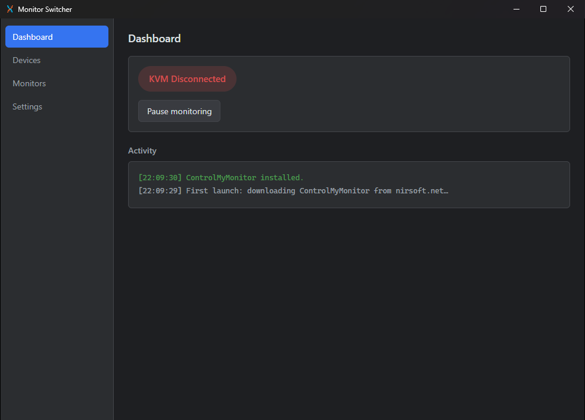
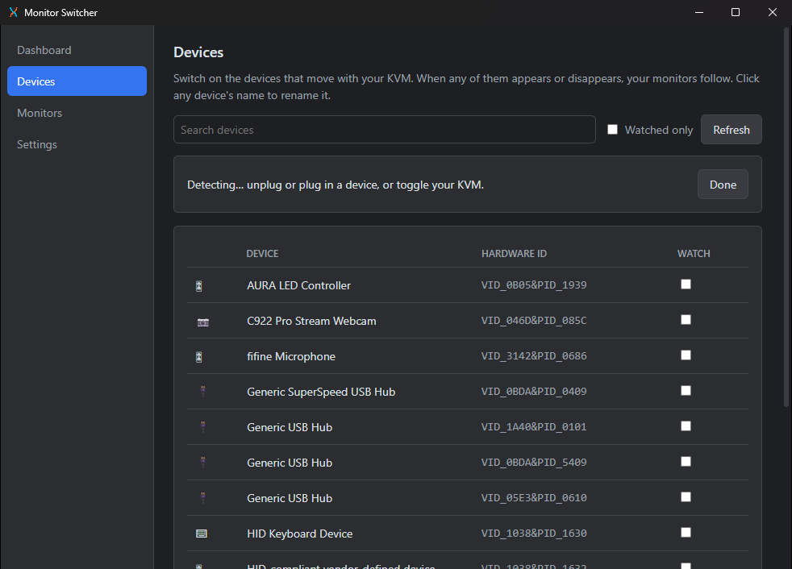
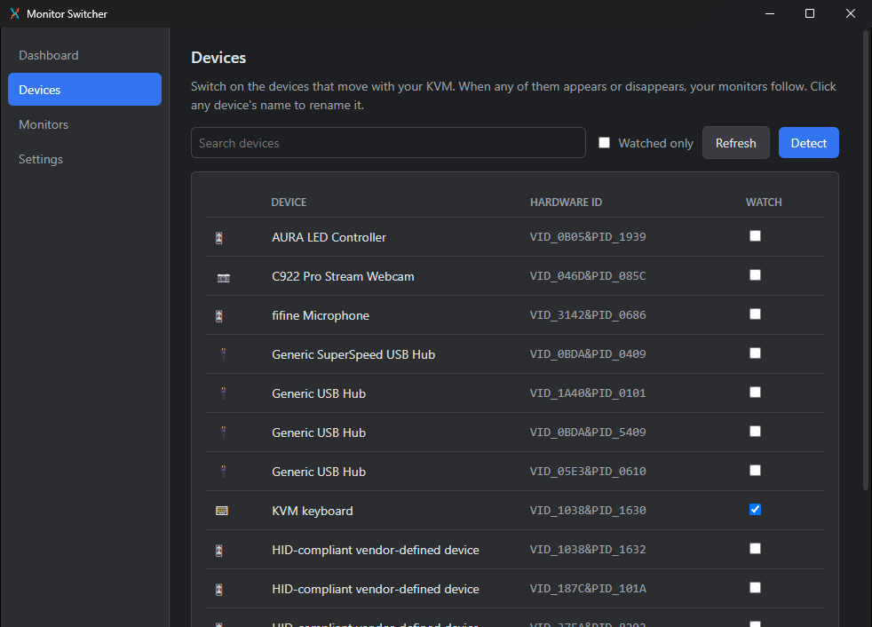
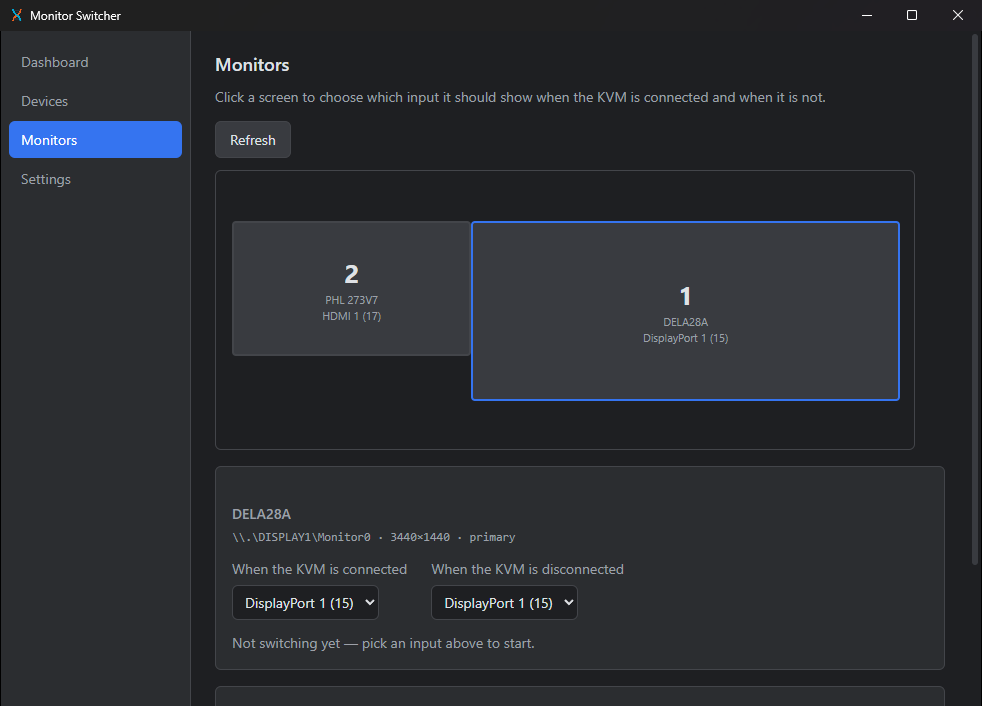
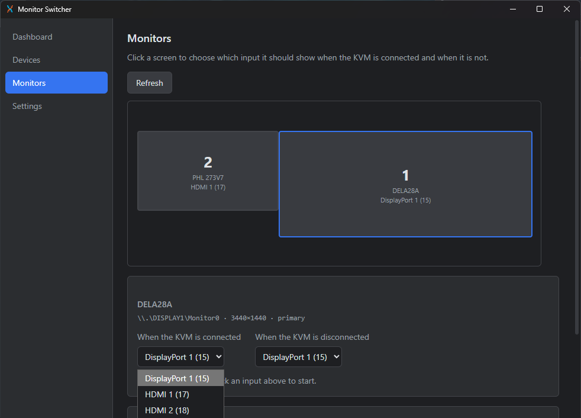
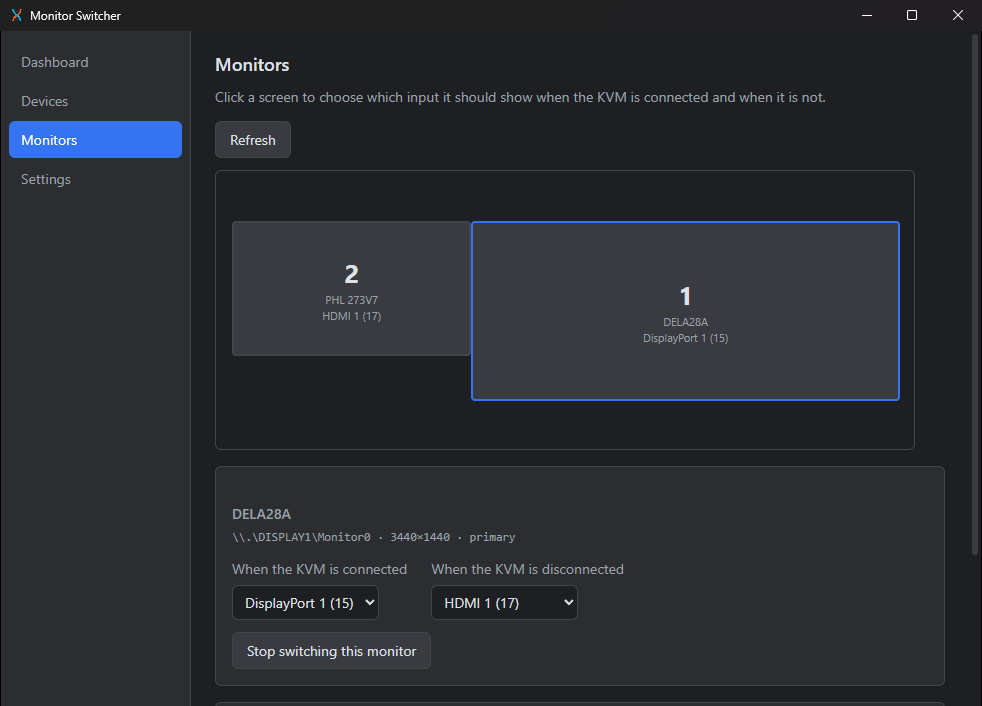
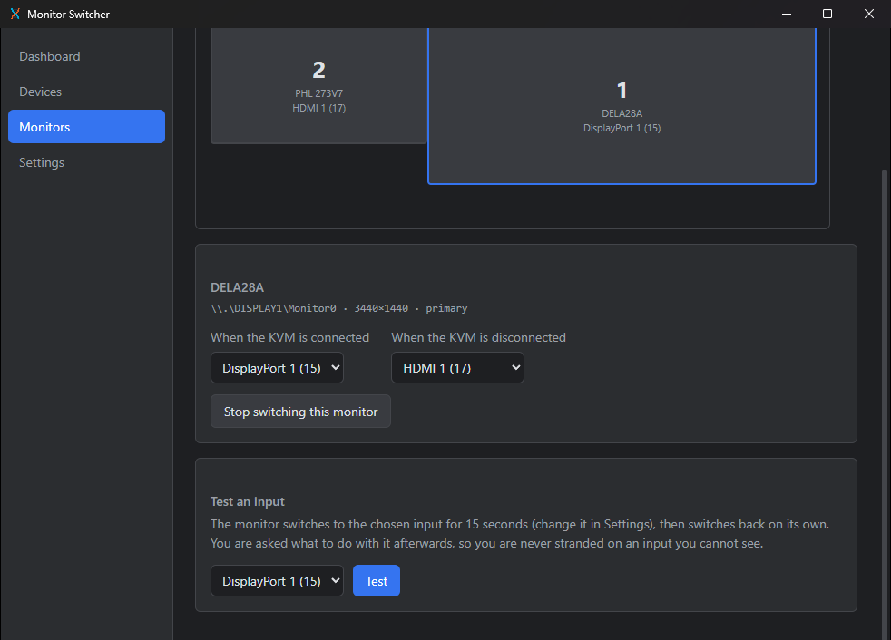
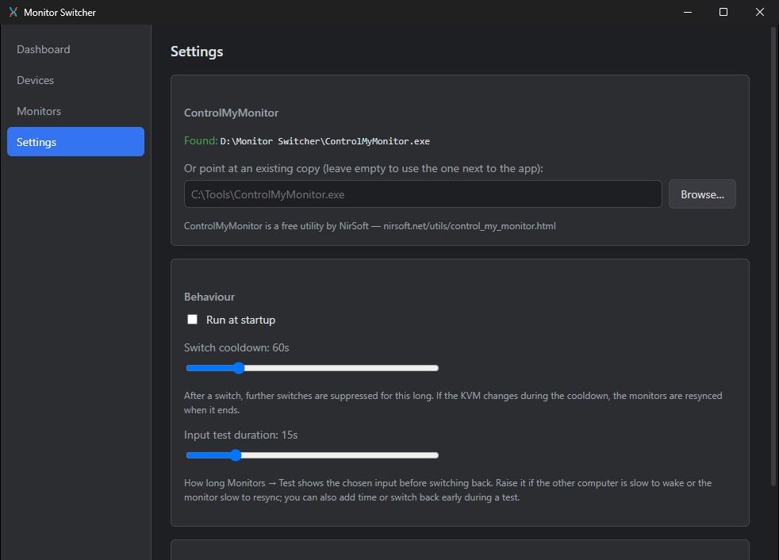
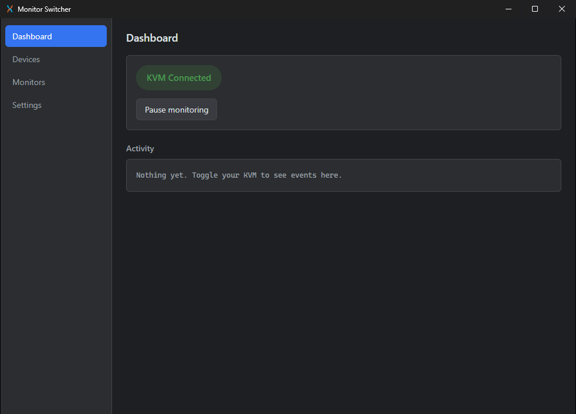

# Setting up Monitor Switcher

This guide walks through a first setup, from download to your monitors following the KVM on
their own. It takes about five minutes.

**What you need**

- Windows 10 or 11.
- A KVM or USB switch that moves your keyboard, mouse or other USB devices between computers.
- Monitors with **DDC/CI** enabled. Most support it, but some ship with it switched off: look
  for "DDC/CI" in the monitor's on-screen menu and turn it on.

**How it works:** Monitor Switcher watches for the USB devices that travel with your KVM. When
they appear, it tells each monitor to show this computer's input; when they disappear, it
tells each monitor to show the other computer's input.

## 1. Install and first launch

1. Download `monitor_switcher.zip` from the
   [latest release](https://github.com/Discobrick/monitor_switcher/releases/latest).
2. Extract it to a folder you'll keep, for example `D:\Monitor Switcher`. The app saves its
   settings next to the exe, so avoid temporary places like `Downloads`.
3. Run `monitor_switcher.exe`.

On first launch the app downloads **ControlMyMonitor**, the free NirSoft tool it uses to talk
to your monitors, into the same folder. You'll see it in **Activity**:

If the download fails (for example, you're offline), the app tries again next launch, or you
can download it or point to an existing copy from **Settings**.

## 2. Choose the devices that follow your KVM

Open **Devices**. This lists every USB device currently connected:

Many devices have generic names like "USB Input Device", so the easiest way to find the right
ones is **Detect**:

1. Click **Detect**.
2. Toggle your KVM to the other computer and back.
3. The devices that came and went are listed. These are the ones that follow your KVM.

Tick **Watch** for one or more of them. Your KVM keyboard and mouse are good choices. Don't
tick hubs or devices built into this computer or the monitor, since they never move.

Click any device's name to give it a label you'll recognise:

## 3. Tell each monitor which input to use

Open **Monitors**. Your screens are drawn as they're arranged in Windows, with the input each
one is showing right now:

Click a screen, then choose two inputs:

- **When the KVM is connected**: this computer's input, used when the watched devices are here.
- **When the KVM is disconnected**: the other computer's input, used when they've gone.

The dropdowns list the inputs the monitor itself reports. The first time you select a monitor
this takes a few seconds; common inputs are shown meanwhile.

As soon as you pick an input the monitor starts switching. **Stop switching this monitor**
removes its rule again.

Repeat for each monitor that should switch. Monitors you leave alone are never touched.

If a monitor doesn't report its inputs, the common ones are listed instead. Typical values are
VGA = 1, DVI = 3, DisplayPort 1 = 15, DisplayPort 2 = 16, HDMI 1 = 17 and HDMI 2 = 18, but
monitors vary, so use **Test** to be sure.

## 4. Not sure which input is which? Test it

Below the inputs, **Test an input** switches the monitor to the input you pick for a short
while, then switches it back by itself:

1. Choose an input and click **Test**.
2. The monitor switches. Watch what it shows. If the other computer is slow to wake, click
   **+10 s**; if you've seen enough, click **Switch back now**. (Your other monitors still show
   this computer, so you can reach these buttons.)
3. The monitor switches back, and only then are you asked whether that input was right. Choose
   **Use when KVM connected**, **Use when KVM disconnected** or **Discard**.

The switch back always happens, even if you change tabs mid-test, so you're never stranded on
an input you can't see.

## 5. Settings

- **Run at startup**: starts Monitor Switcher when you sign in to Windows.
- **Switch cooldown**: after a switch, further switches are held off for this long, so a KVM
  that flickers while switching doesn't bounce your monitors. If the KVM changes during the
  cooldown, the monitors catch up when it ends.
- **Input test duration**: how long a test shows the chosen input (15 s by default).
- **ControlMyMonitor**: where the tool is. Use **Browse…** to pick an existing copy, or leave
  the path empty to use the one next to the app.

## 6. Everyday use

That's it. The **Dashboard** shows whether your KVM is currently connected to this computer,
and **Activity** lists every switch:

Closing the window keeps the app running in the system tray. Right-click the tray icon for:

- **Open**: shows the window again.
- **Pause monitoring / Resume monitoring**: stops or restarts switching, for example while you
  rearrange cables.
- **Settings**: opens the window on the Settings tab.
- **Quit**: exits the app.

## Troubleshooting

**A monitor isn't listed, or doesn't switch.** Check that DDC/CI is enabled in the monitor's
on-screen menu, then click **Refresh** on the Monitors page. Some monitors only accept commands
over certain connections; try the Test flow to see which inputs respond.

**A monitor stayed on the other input after a test.** A few monitors stop listening once
they've switched away. Switch it back with the monitor's own buttons, and raise the test
duration or use a different input.

**The monitors switch more than once when I toggle the KVM.** Raise the switch cooldown in
Settings.

**Two copies seem to be running.** If you previously started an older version at sign-in with a
shortcut of your own, delete that shortcut from your Startup folder (`Win + R`, then
`shell:startup`) and use **Run at startup** instead.

**Where are my settings?** In `config.toml` next to `monitor_switcher.exe`. A config from the
old command-line version isn't carried over: it's renamed to `config.toml.broken` and the app
starts fresh.
